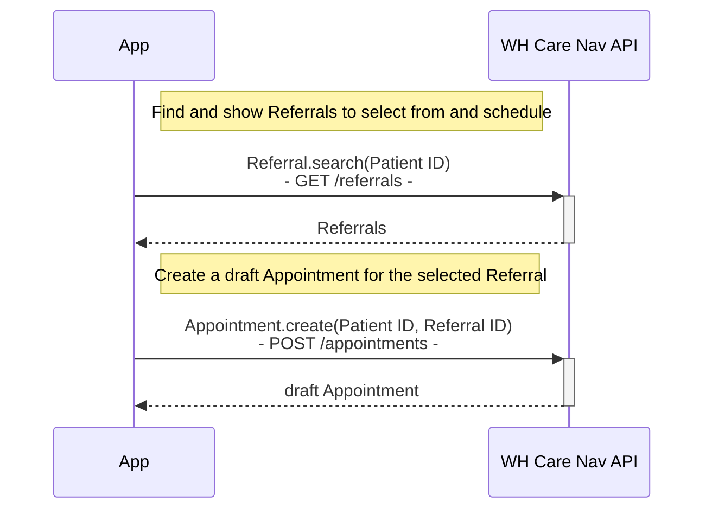
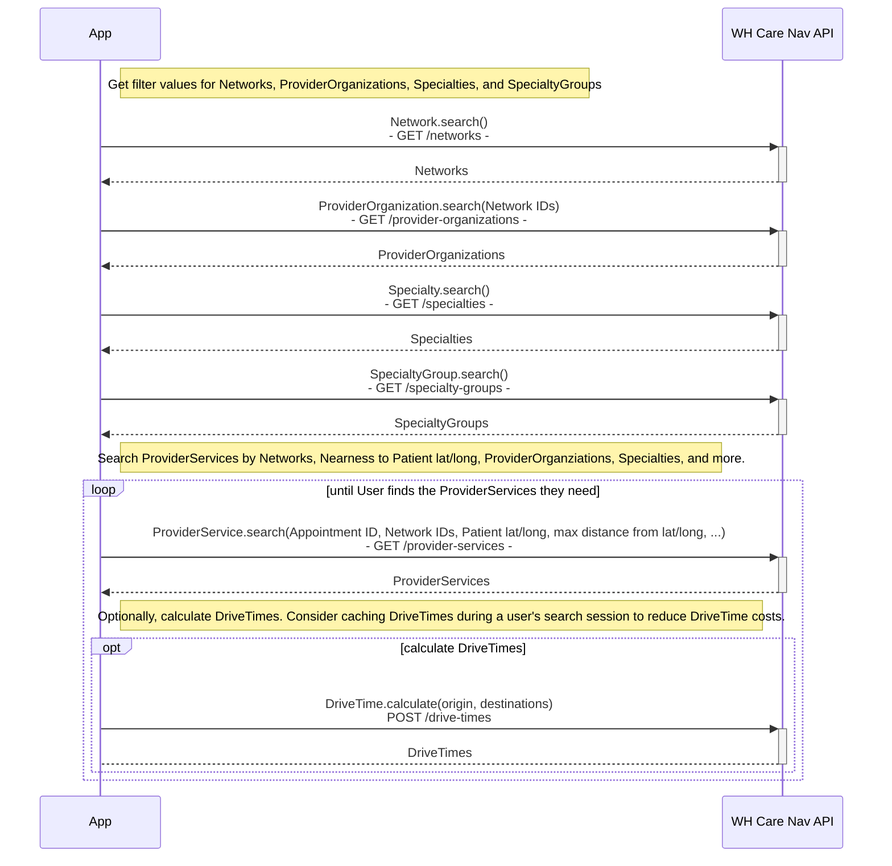
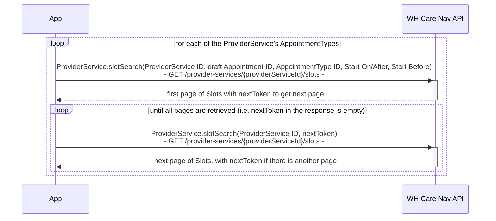
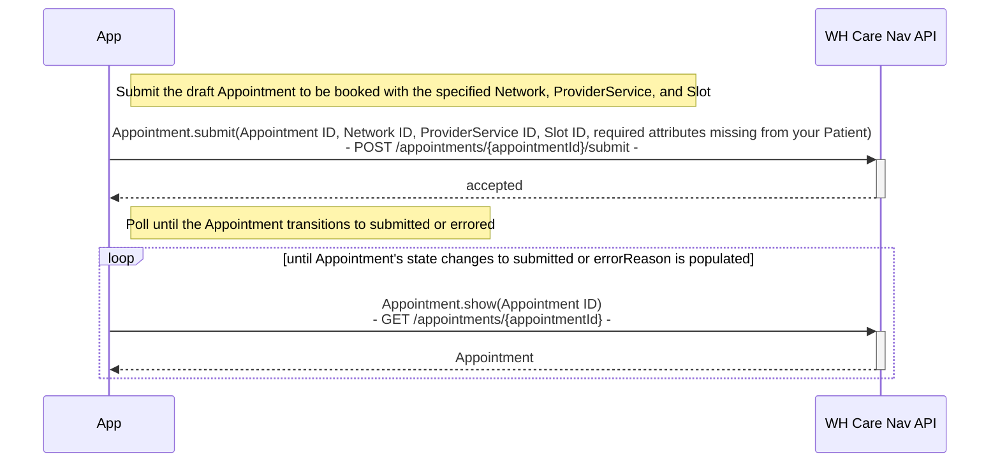
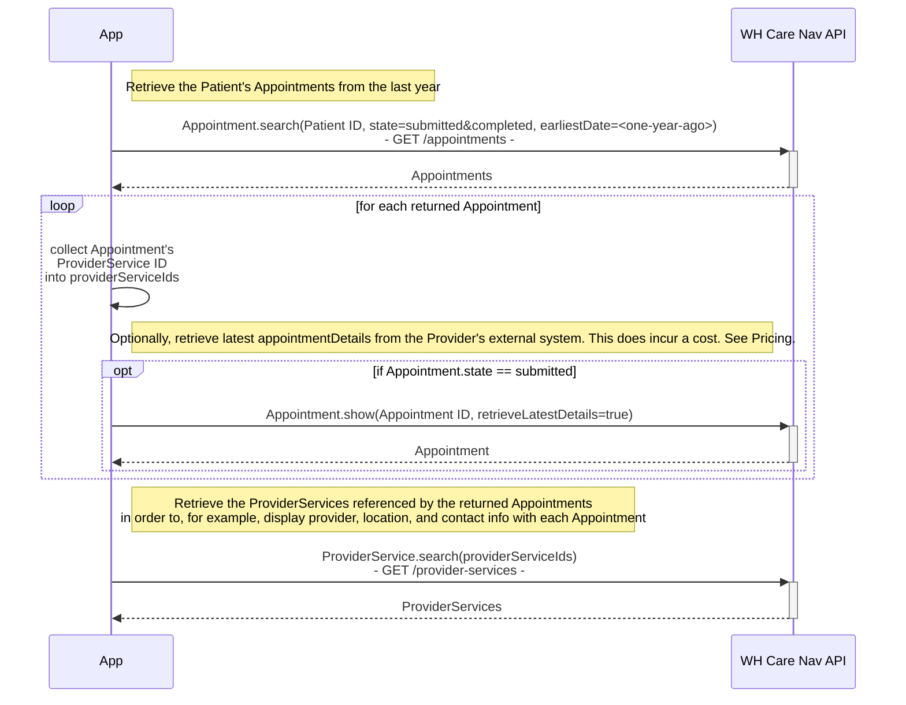
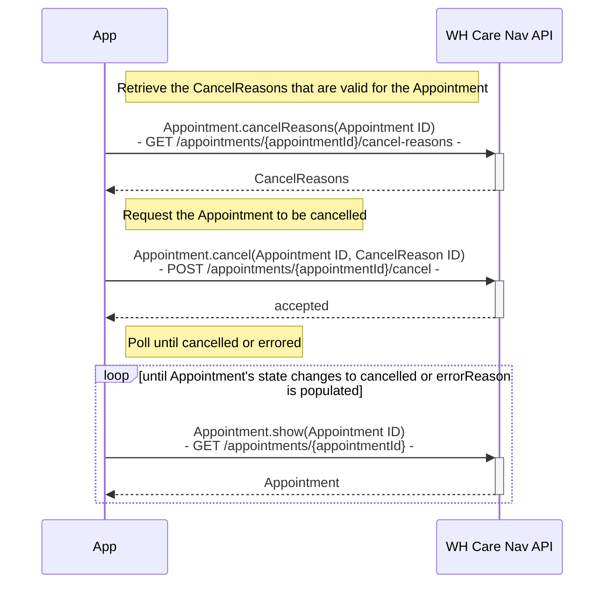

# WellHive Care Navigation API
WellHive offers its customers an API for navigating patients' care across internal and external networks of provider organizations and services.

In this article:
* [OpenAPI 3](#spec)
* [Support](#support)
* [Utilization Quotas](#quotas)
* [Provider Payment Implications](#payment)
* [Authentication](#authn)
* [Common Activites and Call Sequences](#activities)

# <a name="spec"></a>OpenAPI 3
The OpenAPI 3 specification is found here: 

https://wellhive.github.io/api-docs

# <a name="support"></a>Requesting Support
Every response, both successes and errors, will include a `x-wellhive-trace-id` header.  When requesting help, including this header value in your request will allow WellHive support to trace your request and response.

# <a name="quotas"></a>Utilization Quotas
Several actions in this API require utilization quotas. Work with your WellHive account manager to establish a utilization quota for each action.

* ProviderService Search
* Drive Time Calculation
* Slot Search
* Appointment Book
* Appointment Show with retrieveLatestDetails=true
* Appointment Cancel

# <a name="payment"></a>Provider Payment Implications
For some Networks, booking an Appointment implies the Provider can expect to submit a claim back to the organization requesting the Appointment and can expect to receive payment for the services provided.  For such Networks, careful consideration is required when booking an Appointment.  At minimum, a Referral's ID or referralNumber may be required when submitting an Appointment, as indicated by the Network's requiresReferral attribute.  The API client is responsible for specifying a Referral that is in the right state and status.  The API client is also responsible for ensuring the selected ProviderService is appropriate and authorized. The API provides searchable attributes with each ProviderService for assisting in this determination such as Specialties, VisitModes, Networks, Location information, and whether the service is currently "active" and ok to schedule to (as controlled through configuration or integration).

# <a name="authn"></a>Authentication
The WellHive Care Navigation API requires use of Private Key JWT Client Authentication to confirm the API client’s identity.  In Private Key JWT, the client generates a pair of keys, public and private, to use as credentials. The client shares the public key with WellHive and uses the private key to sign the JWT. Then the JWT is provided as the client assertion in requests to the auth server in exchange for an Access Token. The access token in the response should then be used as the Bearer token in requests to the Care Navigation API.

## Generate a Public/Private Key Pair
Generate a public/private JSON Web Key Set (JWKS) key pair.  Work with WellHive support for configuring your WellHive organization with the public key.  Here is an example [command line tool](https://connect2id.com/products/nimbus-jose-jwt/generator) for generating the key pair in the required format.

## Create and Sign a Private Key JWT
Create and sign the JWT with your private key for use as a JWT assertion in the request for a scoped access token. This JWT is only good for up to an hour and so will need to be replaced at least that often.

At a minimum, include the following claims in the payload of the JWT:
* `aud`: `https://login.wellhive.com/oauth2/default/v1/token`
* `iss`: `<your client ID>`
* `sub`: `<your client ID>`
* `exp`: `1614664267`

The full set of possible claims are:
* `alg`: One of the supported algorithm values (RS256, RS384, RS512, ES256, ES384, or ES512). This is required to successfully verify the token by using the signing keys provided in the previous step. The `alg` parameter goes in the JWT header rather than a claim in the payload of the body.
* `aud`: The full URL of the resource that you're using the JWT to authenticate to: `http://login.wellhive.com/oauth2/default/v1/token`
* `exp`: The expiration time of the token in seconds since January 1, 1970 UTC (current UNIX timestamp). This value must be a maximum of an hour in the future.
* `jti`: (Optional) The token's unique identifier. This value is used to prevent the JWT from being replayed. The claim is a case-sensitive string.
* `iat`: (Optional) The issuing time of the token in seconds since January 1, 1970 UTC (current UNIX timestamp)
* `iss`: The issuer of the token. This value must be the same as your client ID.
* `sub`: The subject of the token. This value must be the same as your client ID.

## Get an Access Token
To request an access token using the Client Credentials grant flow, POST the Private Key JWT, requested scope, and grant type as URL-encoded form parameters to WellHive's token service at `https://login.wellhive.com/oauth2/default/v1/token`.

Include the following parameters:
   * `scope`: Include the scopes that allow you to perform the actions on the endpoint that you want to access. There is only one valid scope.
      * `scope=care-nav`
   * `client_assertion_type`: Specifies the type of assertion, in this case a JWT token:
      * `client_assertion_type=urn:ietf:params:oauth:client-assertion-type:jwt-bearer`
   * `client_assertion`: The signed JWT created in previous step
      * `client_assertion=<JWT generated above>`

The following is an example request for an access token (the JWT is truncated for brevity):
```
curl --location --request POST 'https://login.wellhive.com/oauth2/default/v1/token' \
    --header 'Accept: application/json' \
    --header 'Content-Type: application/x-www-form-urlencoded' \
    --data-urlencode 'grant_type=client_credentials' \
    --data-urlencode 'scope=care-nav' \
    --data-urlencode 'client_assertion_type=urn:ietf:params:oauth:client-assertion-type:jwt-bearer' \
    --data-urlencode 'client_assertion=eyJhbGciOiJSU....tHQ6ggOnrG-ZFRSkZc8Pw'
```

Example response (truncated for brevity):
```
{
    "token_type": "Bearer",
    "expires_in": 900,
    "access_token": "eyJraWQiOiJ.....UfThlJ7w",
    "scope": "care-nav"
}
```

Example failure response:
```
{
	"error": "invalid_client",
	"error_description": "The client_assertion signature is invalid."
}
```

# <a name="activities"></a>Common Activities and API Call Sequences
The common activites you'll perform with this API are
1. Start a draft Appointment
2. Search for ProviderServices
3. View ProviderServices' Available Slots
4. Book an Appointment into a Slot
5. Search for a Patient's Appointments
6. Cancel an Appointment

The sections below illustrate the API call sequences for each of these activities.

## 1. Start a draft Appointment
It's recommended to create a draft Appointment and reference that Appointment when searching ProviderServices and when searching Slots.  This way search metrics are collected and associated with the Appointment and Patient.  

It’s also recommended to associate a Referral with the Appointment, whether by ID or referralNumber. Doing so enables tracking search and booking activity to the Referral. In fact, some Networks require at least the referralNumber when booking, and for such Networks, the API won't allow booking without the referralNumber.  

Therefore, a common approach is to start by listing a Patient’s Referrals, and allowing a user to select a Referral that is ready to schedule.  Then, create a draft Appointment with the Referral ID, and use the Appointment ID when searching ProviderServices, searching Slots, and booking the Appointment.  If WellHive is not integrated with the required Referral source but the API client can obtain Referral information, then the draft Appointment can be created with the Referral’s referralNumber.

> ℹ️ WellHive is integrated with your Patient Index, using the same Patient ID that you do.  Therefore, you can use your normal Patient ID to do things like searching for a Patient’s Referrals and Appointments. 

> ⚠️ It is up to the API client to determine which Referrals are ready to schedule.



## 2. Search for ProviderServices
An application can search for appropriate ProviderServices near to the Patient, given a Patient’s location and attributes from a Referral such as authorized Network(s), authorized Specialties, and authorized visit modes.

> ℹ️ WellHive’s ProviderServices search provides an option for requesting drive times from the Patient’s location to each ProviderService’s location.

> ⚠️ It is up to the API client to determine which search parameters to include in order to find ProviderServices appropriate for the Referral.



## 3. View ProviderServices' Available Slots
Given a ProviderService, an application can search the ProviderService’s available appointment Slots.  The sequence diagram below illustrates iterating through each of the ProviderService’s AppointmentTypes, and searching Slots of each AppointmentType.  An application could instead, for example, allow a user to select an AppointmentType and then only search Slots of the selected AppointmentType.



## 4. Book an Appiontment into a Slot
Given a Slot, an application can request to book the Appointment with the desired Network, ProviderService, and Slot.  The request is accepted by the WellHive Care Navigation API, and then processed in the background.  The application can then poll the API to find out the result, checking for the Appointment’s state to change to submitted or for an error.

> ℹ️ Some ProviderServices' scheduling systems require certain Patient fields before allowing an Appointment to be booked. The application should check the ProviderService for which Patient attributes are required, prior to submitting the Appointment.  If the Patient record is missing any of required fields, the application will need to provide them as additional attributes when submitting the appointment, perhaps by prompting the user for those fields.



## 5. Search for a Patient's Appointments
An application can find a Patient’s submitted and completed Appointments, perhaps for displaying those Appointments to the Patient. 



## 6. Cancel an Appointment
Given an Appointment, an application can request that the Appointment be cancelled, and then poll for the result.  The application needs to retrieve the CancelReasons that are valid for the Appointment, and use one of them when submitting the cancel request.


